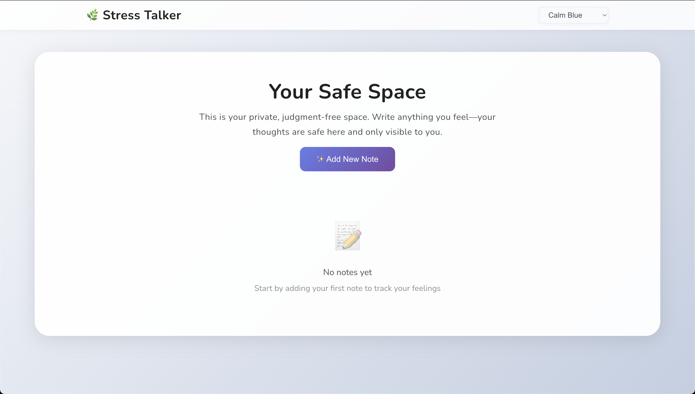

# Stress Talker

## Live Demo

Access the app here: [https://cksharma11.github.io/](https://cksharma11.github.io/stress-talker/)

## About the Project

**Stress Talker** is a modern, calming journaling app built with React. It helps users privately track their feelings, thoughts, and stress levels. Notes are stored locally in your browser (no login required), and the app is designed to be supportive, judgment-free, and easy to use on any device.

### Key Features
- **Add, view, and delete notes** about your feelings and stress
- Each note includes a title, emoji (happy or stressful), and detailed description
- Notes are stored in localStorage for privacy and persistence
- Beautiful, calming, and responsive UI inspired by top journaling apps
- Multiple soothing themes, including a 'calm flower' flavor
- PWA: Installable and works offline
- Custom confirmation modal for deleting notes
- Mobile-friendly with card-style notes and large touch targets
- Navigation with React Router

## Use Cases
- Daily journaling for stress relief and self-reflection
- Tracking emotional patterns over time
- Creating a safe, private space for thoughts and feelings
- Using on-the-go as a mobile PWA
- No account or cloud required—your data stays on your device

## Getting Started

1. Clone the repo: `git clone https://github.com/cksharma11/stress-talker.git`
2. Install dependencies: `npm install`
3. Start the app: `npm start`

## Deployment

This app is deployed to GitHub Pages at: [https://cksharma11.github.io/](https://cksharma11.github.io/stress-talker/)

---

© 2025 Stress Talker
